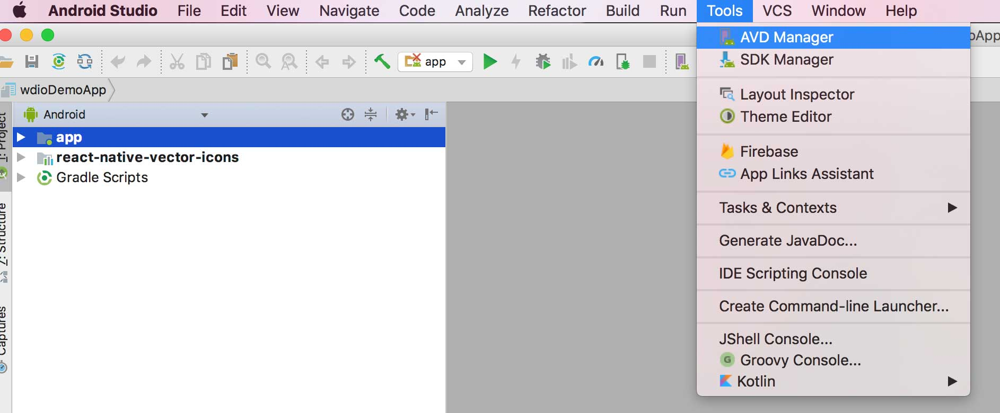
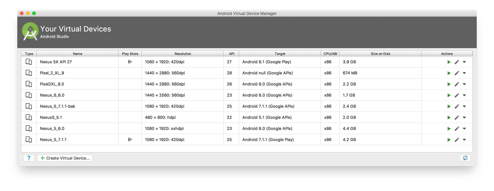
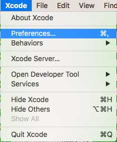
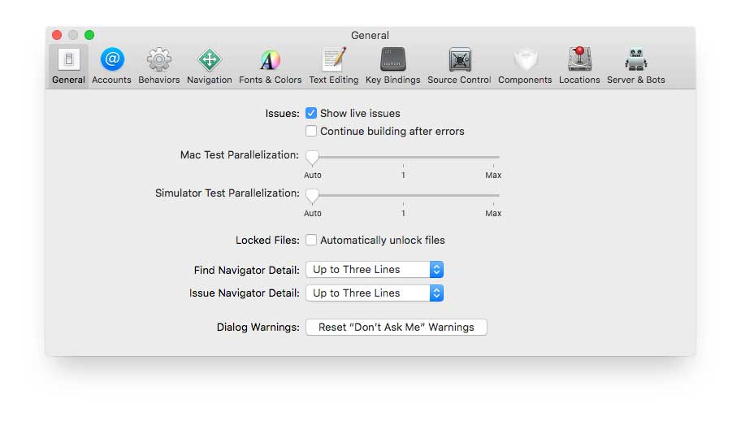
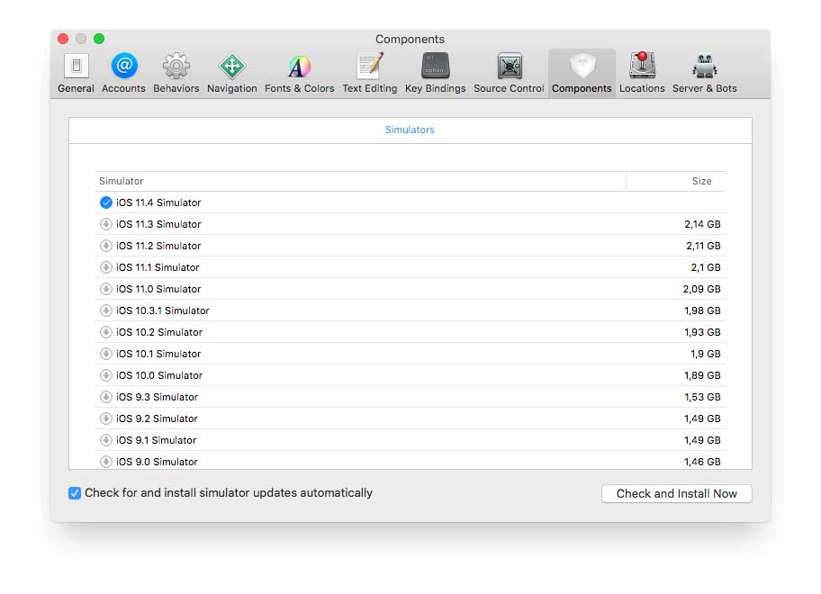
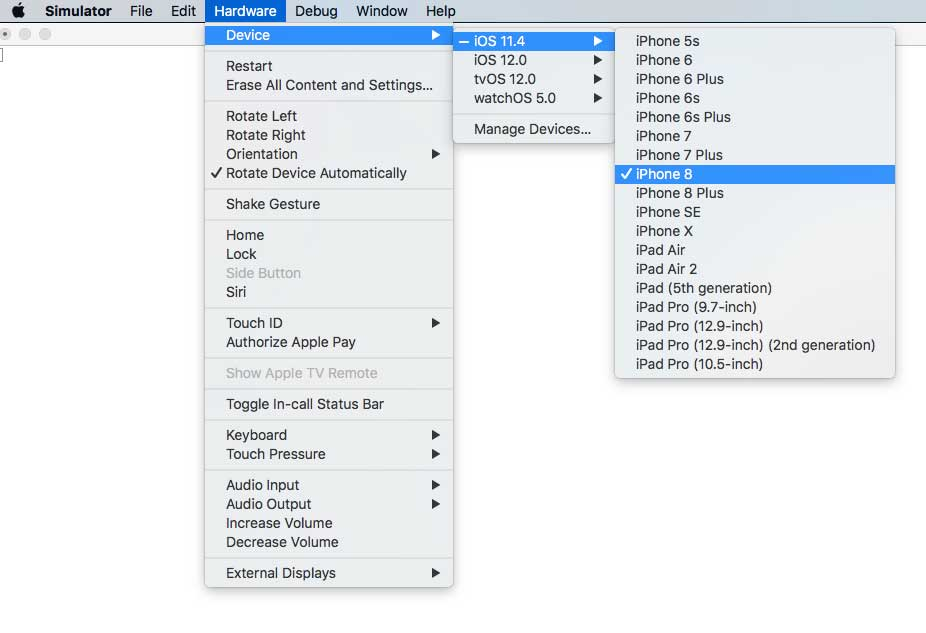

# Setting up Android and iOS on a local machine

## Android
To use this boilerplate on a local machine for Android, emulator(s) need to be available.
To setup your local machine you should download Android Studio, see for instructions [here](https://developer.android.com/studio/).

Follow the instructions to download and setup Android studio and configure a your emulators with [this](https://developer.android.com/studio/run/managing-avds) tutorial.

Please use Google to find the correct instructions to setup your environment (Windows / Mac / Linux).

### Start the emulator
If you were able to create emulators you can use the following options to start the emulators

- From Android Studio itself through:
    - Open `Tools > AVD Manager`
    
    
    
    - Select your emulator and click on the `play`-button
    
    
    
- From the command line with the default Android commands, see [this](https://developer.android.com/studio/run/emulator-commandline) link
- Use a module called `start-android-emulator` which can be found [here](https://github.com/wswebcreation/start-android-emulator)

> It is advised to keep an emulator open and start tests against an already opened emulator to speed up tests. Starting an emulator manually/by Appium is time consuming and will slow down the test execution.

## iOS
Make sure you have a Mac, if you don't have a Mac then buy/get one, otherwise it will not work (no legal way to use iOS on Windows/Linux).

To be able to configure iOS simulators you need to download Xcode on your machine, check [this](https://developer.apple.com/xcode/) on how to install it.

### iOS versions
After installation you'll get the latest supported iOS version already installed. At the moment of writing this was `iOS 12.0`. If you want an older version of iOS please download them manually by doing the following:

1. Open Xcode (you don't need to start a project, having the project selector open is sufficient)
1. Go to Xcode preferences like below

    
    
1. A pop-up will appear like below

    
    
1. Go to `Components` and download the needed versions like below 

    
    
    
### Start a simulator
You can use the following options to manually start a simulator:

- Through the Simulator app, find it on Mac and add it to your dock like below

    

    

- Use a module called `start-ios-simulator` which can be found [here](https://github.com/wswebcreation/start-ios-simulator). With this module you can easily use your terminal to select your simulator

> It is advised to keep a simulator open and start tests against an already opened simulator to speed up tests. Starting a simulator manually/by Appium is time consuming and will slow down the test execution.
